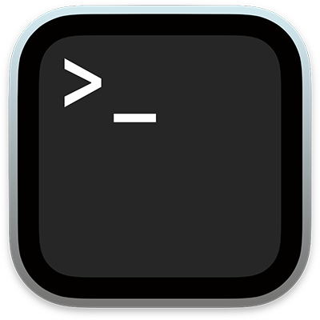
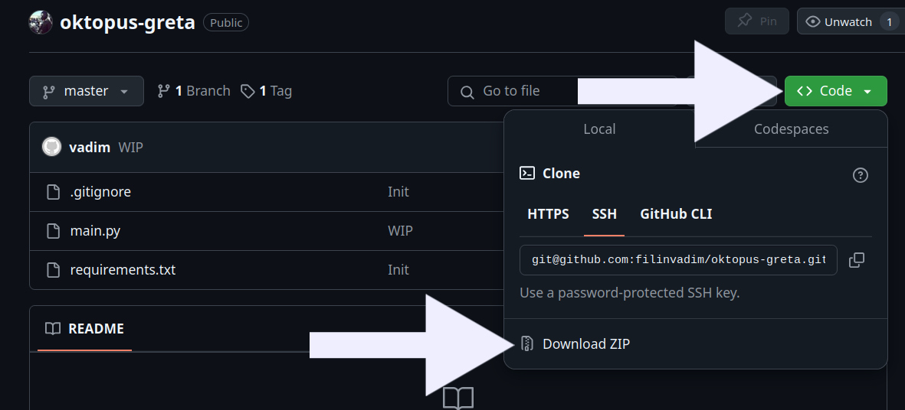
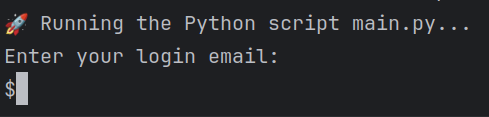

# 📘 **How to Run the Script on a MacBook**

This guide will walk you through every step required to run the application
on a MacBook, even if you have no prior technical experience.

Supported platforms - MacOS and Linux (no Windows, sorry).

---

## 🛠️ **1. Prerequisites (What You Need)**
Before running the script, make sure you have the following:

1. **A MacBook** with macOS (any version like Monterey, Ventura, etc.).
2. **Terminal Application** — This is pre-installed on all MacBooks.  
   📍 **How to open Terminal?**  


   - Press **Cmd + Space** to open **Spotlight Search**, type **"Terminal"**, and press **Enter**.  
   - Or, go to **Applications → Utilities → Terminal**.  

---

## 📦 **2. Download the ZIP Archive from GitHub**



1. **Download the ZIP file** from GitHub.  
   - Open your browser and go to the **GitHub repository** URL.  
   - Click on the green **"Code"** button.  
   - Select **"Download ZIP"**.  
   - The ZIP file will be downloaded to your **Downloads folder**.

2. **Unzip the archive**.  
   - Double-click on the ZIP file to extract its contents.  
   - This will create a folder with the same name as the repository.  

---

## ⚡️ **3. Run the Script**

1. **Open Terminal**.  

2. **Navigate to the unzipped folder**.  
   - If the folder is in your **Downloads** directory, use this command:  
     ```bash
     cd ~/Downloads/name-of-the-unzipped-folder
     ```

   **name-of-the-unzipped-folder** is a name of the folder that was extracted from the ZIP archive.

3. **Run the script**:  
   ```bash
   ./run.sh
   

## 🐞 **4. Common Errors and How to Fix Them**

| **Error**                      | **What It Means**                        | **How to Fix**                           |
|---------------------------------|------------------------------------------|-----------------------------------------|
| **Permission denied**           | You don't have permission to run the script.| Run `chmod +x run.sh` and try again. |
| **python3: command not found**  | Python 3 is not installed.               | Install Python 3 via Homebrew: `brew install python`. |
| **pip3: command not found**     | pip is not installed.                    | Run `python3 -m ensurepip && python3 -m pip install --upgrade pip`. |
| **requirements.txt not found**  | The file is missing.                     | Make sure the ZIP archive was extracted properly. |
| **my_script.py not found**      | The file is missing.                     | Make sure the ZIP archive was extracted properly. |

## 🐞 **5. Login**


  - Enter your Oktopus application email (your typing will be visible)
  - Enter your Oktopus application password (your typing WON'T be visible)

## 🐞 **6. App is running**
  Application will run in the infinite loop and book all DUMBELL CROSSFIT classes at 8:30 pm. 
No further actions needed.
